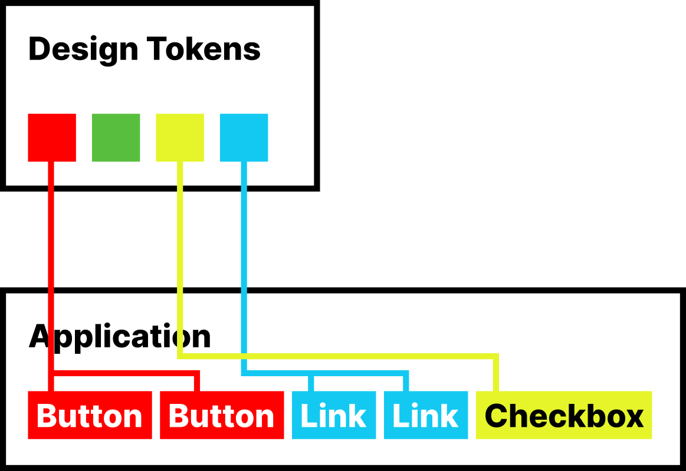
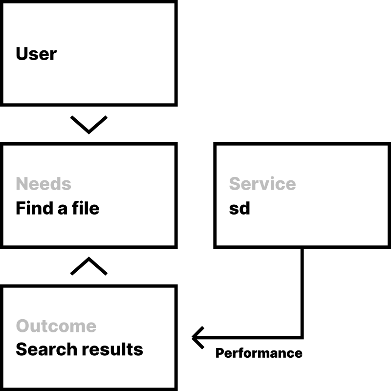

Last week, I traveled to Budapest for a weekend getaway. 

I got up, took a shower, had a coffee, grabbed my things, took the train, went through airport security, found my gate, boarded the plane, watched an episode of Black Mirror, got out of the plane, left the airport, and went on to my day of sight seeing.

Without services, none of this would have been possible.

The water I used for showering reaches me through infrastructure provided by the government, which I pay for in taxes and monthly payments. The coffee beans I used for my coffee were delivered to me a few days prior, traveling through Amazon's vast logistics infrastructure after my request submitted through an app on my phone. Public transit, again, is a transportation service funded by the government and my monthly payments as a transit user. Airport security is necessary service that builds trust between me and airlines, and eventually the states allowing me to enter them without screening me specifically. Airlines are service providers that allow me to travel practically anywhere on this planet in less than a day. When I entered the Budapest airport, the Hungarian government simply allowed me in — not because they trust me, but because they trust the service that issued my passport. 

As citizens, users, and human beings in this day and age, we have become dependent on services. They allow us to have roofs over our heads, meet basic sanitary needs, be financially flexible, and provide us with the goods we need to biologically survive and procreate. Through society and monetary exchange, humanity has learned to exchange not only goods, but also efforts and experiences. We exchange value for value — money for affordances that allow us to depend on a third party to perform something we need.

In the late 20th century, digitalization began. And with it, services have moved on to their digital habitat — which allowed them to scale to incredible levels. 400 hours of video are uploaded to YouTube every single minute [@youtubeHours]. In 2011, global payments networks processed 74 Billion transactions [@transactions]. Social media users post 95 million individual images and videos on Instagram each day [@instagram]. In the last official statement on the matter, search-giant Google reported "_more than a billion searches per day_" [@searches], or 11574 searches _per second_. As this number was reported in 2010, it is only logical to assume today's numbers are even more impressive.

Each of these services are relatively simple on the surface. At the end of the day, they all provide you with a specific outcome for which you pay for in some way or the other. You, as a user, receive the outcome. And for it, the service receives something in return — something that, besides making a profit, it can use to uphold the vast infrastructure needed to provide its users desired outcomes.

Below the surface, every single one of these services starts to look a bit less simple. Service meshes of overwhelming complexity perform in itself incredible feats to provide parts of what is needed to provide that desired outcome. At this point, both the user and service are machines. Netflix, a video streaming service, hosts its video library on Amazon servers, using Amazon Web Services [@netflixAws]. Amazon offers this service to essentially lease its global infrastructure to third parties that want to offer digital experiences on their own. Netflix itself is entirely dependent on such a service, because building the kind of incredible network, with hundreds of data centers around the world and intricate mechanisms to intelligently balance load across the planet, is not its competence as a business entity. Netflix streams video — they don't host the videos themselves. Similarly, many digital experiences rely on tens to hundreds third party "sub-processors" — services that power things from marketing and data analysis to authentication and fraud detection (e.g. 56% of public websites use Google Analytics [@GoogleAnalytics]). 

This thesis aims to distill a framework for modeling digital service concepts by breaking down fundamental mechanisms into "atomic functionality", to then build up a multi-layered model that can be applied to individual services as well as multi-service relationship patterns. We will study paradigms from the world of Software Engineering and User Experience Design to base our model upon, attempting to deliver a coherent concept that can be used to design, define, analyze and optimize digital services. 

The desired outcome is that you as the reader adopt a modular way of thinking that allows you to understand and oversee the development of digital services across different fields.

# Defining and modelling services

To begin building up our framework, we need to first clarify the concept of "services" to understand which actors and concepts play a part in our analysis.

## Finding a service definition 


{ height=64px }

While there are many slightly different definitions of the "Service" concept to be found in literature, a common definition includes two actors — the service itself and its user [@servicedefinition1].


{ height=64px }

The User in this model has a set of needs [@servicedefinition2], which causes seeking the respective service in the first place.


{ height=149px }

Through economic definitions [@servicedefinition4], we can add an exchange of value between these two parties. After all, without any value being provided in any way, potential users would have no incentive to actually become users (_convert_) [@servicedefinition5]. In parallel, the service provider would have no incentive to support the service itself. 

The clear difference between traditional goods exchanges and services is that a service, at least in its core value definition, _does not provide you goods_, but outcomes — with the service itself being _intangible_ [@servicedefinition6].

When purchasing an item, a value transfer takes place [@servicedefinition7] — and after that, the client possesses the item that value was exchanged for. In a service context, the value is not manifested physically [@servicedefinition8]. For example, I can pay a service like Boldking on a monthly basis to deliver me razor blades every few weeks [@boldking]. While I do receive physical goods as part of this agreement, the _outcome_ of this service is _receiving fresh razor blades every few weeks_. By subscribing to this model, the user can rely on a third party to supply them with a frequently needed physical good, shifting responsibility from the user to the service, in exchange for monetary value. This kind of recurring, stable model allows the service provider to optimize their service's intricacies to a point where subscribing to a recurring service performance is often more lucrative for the user than sourcing the desired item on demand [@morelucrative].

The service receives value from the user as well — may it be monetary, or something more abstract that represents value in another form. For example, search-giant Google offers _free services_ such as Google Mail or Google Maps. Those services do not require the user to pay in order to use them, but they generate valuable behavioral and personal data that Google is able to enrich by cross-referencing information from all their services, allowing them to lucratively monetize by using this information to provide another range of services — advertisement targeting [@googleprivacy]. By combining these offerings, Google is able to provide vast value [@googleprofit] to separate markets and its shareholders.

We can define these aspects in our model by adding the _outcome_, which satisfies the user's needs, and an _agreement_, which represents the value exchange between the service provider (in this representation, the service provider is represented by the service itself).


{ height=216px }

In order to provide an outcome, a service _performs_ [@performance]. The _performance_ is commonly defined as the sum of all mechanisms that act together as part of the service to create the desired outcome. When a user orders an item on Amazon, for example, the Amazon E-Commerce platform performs feats of logistics operations with the outcome being the desired item in your hands in often less than 48 hours [@amazondeliverytime].

In this model, we can define the _performance_ as the connection between the service, as the performing actor, and the _outcome_, which said performance leads to. 


{ height=216px }

And with that — we have our base model and definition.

> Services provide outcomes that satisfy user needs by performing the feats necessary to achieve said outcome.


## The layer model

In order to explore our service model in greater detail, let us break down the service concept into multiple layers.

What we looked at so far can be defined as the _Macro layer_, where we look at a single service – outcome – user relationship. The _performance_ in this model a cluster of more services, each performing a smaller action that together allow our macroscopic service model to function and perform. Let us define this as the _Micro layer_, which represents all of these smaller sub-services as a whole. 

Multiple services often work alongside each other to make sense together. The actors in the above defined model do not necessarily need to be aware of this fact. Let us go back to Google's core business model — offering consumer services that generate valuable data to power an advertising platform capable of detailed profiling and campaign targeting. For this reason, let us add another layer on top of our macro layer: the _Service Landscape_.

In the following chapters, we will explore these layers in more detail, bottom to top.

# Atomic Functionality — Breaking down performances into micro-actions

Let us begin by taking a look at the first level in our model: The micro-layer.

As we discussed in Chapter 1, a service _performs_ in order to provide an _outcome_. In this chapter, we will study a selection of patterns from the world of engineering in order to distill a model that allows us to represent and think about _performances_ in an approachable fashion.

### Tech matters

Frequently, the core value definition of a service directly references its technical capabilities. For example, one of the main selling points of Google Docs, an online document editing platform, is its real-time document sharing, where multiple parties can work on the same document over the Internet [@googleDocs]. The core offering of Google Docs has fundamental implications for its system architecture: Communication and databases need to work in real-time and instantly synchronize across multiple clients [@postgresRealtime]. This illustrates why the technology behind a service is not just a necessity, but a core part of its design as a whole: User Experience specifications impact key system architecture decisions directly [@architecture].

## Engineering at scale

The concept of _technical debt_ defines how hard a codebase is to expand, adjust and scale [@technicalDebt] — in short, to maintain. A frequent contributor to _tech debt_ is code duplication — the same mechanism implemented repeatedly in different parts of the codebase [@codeDuplication]. This, together with a lack of documentation, elevates maintainability effort [@maintainability], which directly equates to technical debt.

Thus, one of the most popular principles in software engineering is DRY coding [@dryPopular] — Don't repeat yourself.

## Keeping it dry

The DRY principle is stated as:

> Every piece of knowledge must have a single, unambiguous, authoritative representation within a system [@dry].

Any repeatedly occurring constant should be defined so that any dependent function simply references this single, global definition. 

It is easy to imagine pragmatic examples for this concept: When a service with an unfortunate code quality goes through a re-branding procedure, changing one of its primary brand colors represents an excruciating task of hunting down every occurrence of the hard-coded color variable and changing it individually. If a _single source of truth_ were referenced instead however, this global could simply be updated and the change would instantaneously propagate through all of your interfaces automatically.

The concept of storing fundamental constants and repetitive patterns globally in the context of visual design for digital products is frequently applied as part of _Design Systems_. A Design System is famously defined as a library of reusable User Interface components, often co-existing as design specification and production-ready code components [@whatisDesign].

Design consultant B. Frost in 2013 coined the term "Atomic Design", which is a methodology for creating Design Systems divided into 5 levels: 

1. _Atoms_, tiny, abstract elements, "like color palettes, fonts and even more invisible aspects of an interface like animations", or basic HTML tags in the context of a website, such as a form label, an input or a button [@atomicWebDesign].
2. _Molecules_, "relatively simple combinations of atoms built for reuse", such as form fields jointed into a full form [@atomicWebDesign2].
3. _Organisms_, "groups of molecules joined together to form a relatively complex, distinct section of an interface", such as the header of a website. This is where the analogy starts becoming specific to distinct projects [@atomicWebDesign3].
4. _Templates_, "groups of organisms stitched together to form pages", such as a generic, wire-frame version of an article page for a news website [@atomicWebDesign4].
5. _Pages_, "specific instances of templates" [@atomicWebDesign5].

A specific implementation of a design system, "Lightning Design" by CRM behemoth Salesforce, takes _Atoms_ a step further and proposes a single source of truth for _atomic constants_, the very fundamental values that encode and express a brand visually.

> Design tokens are the visual design atoms of the design system — specifically, they are named entities that store visual design attributes. We use them in place of hard-coded values (such as hex values for color or pixel values for spacing) in order to maintain a scalable and consistent visual system for UI development. [@designTokens]

In essence, this allows sharing constants like colors not just across one application, but a full suite of implementations. If the source of truth is adjusted, everything updates globally.


{ height=157px }

The Design System concept exhibits strong parallels to _Composability_, an often-cited principle in system design, generally referring to the design of systems using self-contained, modular pieces that can be individually adjusted, changed and upgraded [@composability].

## The Unix Philosophy

A well-known manifestation of the DRY paradigm as a composable system is the Unix Philosophy, originated by Computer Science pioneer Ken Thompson in the late 1970s [@unixOrigins]. Unix is a command-line based operating system developed at Bell Laboratories that has since grown to be the basis of modern operating systems such as Ubuntu and Mac OS to this date [@macOs]. If you open the Terminal application on a MacBook today, you are interacting with a Unix system directly. User interfaces on these systems are simply executing commands like these behind the scenes. 

The Unix philosophy, summarized by computer scientist Peter H. Saulus in 1994, entails: 

- Write programs that do one thing and do it well.
- Write programs to work together.
- Write programs to handle text streams, because that is a universal interface. [@unix]

The first paradigm represents a striking similarity to DRY. In Unix, it is possible to string multiple commands together and _pipe_ (represented by the pipe character | ) the first one's input into the next [@pipelines]. For example, the command `ls` (for _list_) simply prints the names of files and folders in the current working directory to the screen: 

```
$ ls
uglyCat.jpg
beautifulCat.jpg
dog.jpg
```

Another Unix application, `grep`, takes an input and outputs a filtered version based on a search term. By _piping_ the output of `ls` into `grep`, we can search the working directory's contents. Let us say we want to find the image of the dog in this folder. 

```
$ ls | grep "dog"
dog.jpg
```

As you can see, `grep` filtered the output of `ls` so that the resulting output is only the line including the term "dog". 

This demonstrates the paradigm perfectly: Both `ls` and `grep` do one thing, and they do it well. By stringing together multiple applications and making them interact with each other, we can quickly perform much more complicated patterns.

What does this have to do with services?, you might ask — let me tell you.


## Service Thinking in System Architecture

Let us think about what `grep` and `ls` really are. We, as the user, have a need — we need to find a file in our directory. `ls` and `grep` individually perform parts of what is needed in order to generate an outcome that satisfies our need — a filtered list of files in a directory. 

You might already be able to tell where this is going — we can treat `ls` and `grep` as _services_ as defined in Chapter 1. For the sake of simplicity, let us assume we write a simple script that encapsulates `ls`'s output piped into `grep` as a single command — `sd`, for _search directory_.

```
$ sd "dog"
dog.jpg
```

Now, we can define `sd` as our macroscopic service — with `ls` and `grep` acting as the atomic functionality, or _microservices_ inside, allowing `sD` to perform. 


{ height=234px }

Since `sd` is very simple, and we know exactly just how it achieves its outcome, we can go a step further and visualize the performance. Now, `sd` acts as the user to our two other services – `ls` and `grep`. By chaining our two bits of atomic functionality together, `sd` is capable of performing a vastly more complicated action. 


Both `ls` and `cd` are entirely unaware of their role in this system. They simply perform the action they are designed to perform, nothing more, nothing else. They receive an input and provide an output — how said output is processed afterwards is irrelevant. 

In this example, `sd` is our macroscopic _service_, and `ls` and `cd` act as _microservices_.

### Microservices in real-world applications

More and more frequently, sophisticated systems are designed with the _Microservice_ paradigm [@msPopular], manifesting striking similarities to DRY and the Unix philosophy. In a Mircoservice pattern, business logic is split into _single responsibility_ atomic bits that each _do one thing, and do it well_. These services are _decoupled_, meaning they each have their own separate place to live in and act, and do not know or care about others performing tasks around them [@microservices].

This kind of architecture comes with lots of benefits. Each little mechanism is ideally so small that its functionality can be described and documented in an extremely simple to understand way. More complex logic is simply a result of orchestrating individual small mechanisms in order to achieve the desired end result [@microservices2].

# The Service Baseline — Shaping service clusters through user-driven design

In this chapter, we will take a closer look at the macroscopic level — simply referred to as _the service_ itself. This layer is what our end-user is actually interacting with [@humans]; the face of the complicated inner workings that all together perform to generate the service's outcome.

## Humans as users

While in Chapter 2's micro-layer, the users of our services are machines, at the macro-level, our users are humans. Since our end-goal is solving needs for these very human users, this layer defines our design approach and ultimately dictates our service's design as a whole. This is where _User experience_ (UX) and _User interface_ (UI) design come into play.

The international standard ISO 9241-210 defines _User Experience_ [@userexperiencedefinition]:

> User Experience is a person's perceptions and responses that result from the use or anticipated use of a product, system or service.

Most services, unless their existence is justified by necessity or scarcity alone, need to optimize User Experience in order to convert and retain their customers. And because our end-users are human, human-centered design is one of the most important paradigms in shaping and designing a service.

User Experience and User Interface are often used interchangeably — but in reality, their meaning is different in very important ways. 

The Oxford Dictionary defines _User Interface_ [@userinterfacedefinition]:

> The means by which the user and a computer system interact, in particular the use of input devices and software.

"User Interface" can thus be summarized as the _medium_ our user interacts with our service through. 


{ height=160px }

Many aspects of this are standardized; in the example of a web application or website for instance, a user is as of writing 63.4% likely to access a website through a mobile device, such as a smartphone [@smartphoneUsage]. As such, naturally the scope of user interface design for such a product is restricted to the website itself — typically living inside a web browser. _User Experience Design_, however, goes beyond this — in fact, the conclusion of choosing the web as a medium is, due to the vast implications on perception, a key User Experience decision. 

To sum it up; _User Experience Design_ is optimizing the qualitative sum of experiences and perceptions in the context of interacting with a product. The _User Interface_ is the medium that a user interacts with while using a service.

### Defining the service baseline

In order to bring end-users into the equation, our model needs an indicator of end-user _interaction_. In order to represent the point at which users actually come into contact with our digital product, we can define the _service baseline_ as this very point — the face of our service.


{ height=196px }

In essence, we can define the _service baseline_ as the point-of-contact in our system that sits directly adjacent to the _user interface_ in order to represent the point in our system that shapes our service as part of a _user-driven design_ process.

## Lowering cognitive complexity

In Chapter 2, we have briefly looked at the world of engineering and one of its most important paradigms — "don't repeat yourself": Defining constants and functionality as re-usable atomic bits that are shared across all dependent mechanisms.

Product & User Experience Designer B. Oxendine highlights a similar line of thinking in designing the actual interfaces that users interact with.

> (...) if you’re starting with a system — a system of components, a structure of where things in the app live — then it should be relatively clear where to place things. It’s important to understand the basic functions of your app, like let’s say adding an item in a to-do app, and putting those basic functions into logical groups where they can be reused elsewhere in the experience. So you don’t end up designing two ways of adding a to-do in two different locations. [@brandonInterview1]

When asked about why having two different ways to achieve the same thing is not optimal, he continued:

> If you reduce the total amount of concepts a user has to learn in order to use the app, then the app becomes easier to understand. (...) More screens, really, more anything in your app automatically makes it harder to understand, naturally. Your users won’t understand why there’s two ways to do the same thing, they'll think that there has to be a difference somehow. [@brandonInterview2]

In Chapter 1, we have learned from Engineers that achieving the same end-result in different ways in the context of a single service introduces problems — in User Experience Design, it is also considered bad practice, but resulting from a very different perspective: The unnecessary complexity directly affects your users, who after all are the ones that actually need to understand a user interface in order to use a service.

### Matching concepts across use-cases

B. Oxendine brings up the example of a to-do service, in which you can create to-dos and then set reminders for those to-dos. 

> (...) think of the things you can do with a to-do in this theoretical to-do app: you can create one, edit it, delete it, maybe put a reminder on it. (...) It wouldn’t be good to create to-dos and reminders as separate concepts. They should exist in the same system. [@brandonInterview3]

What becomes apparent now: A service that solves multiple interconnected use-cases should tie their resolutions together so that the service as a whole is aligned and easy to understand. But what is it about reminders and to-dos specifically that makes it natural to merge them into one "concept"?

> Well, a to-do has everything a reminder needs to be useful, like, some text, a deadline and a checkbox, and a reminder is like an extension of that. In this case maybe you get a notification about your to-do. You can create reminder functionality by notifying a user about a to-do and the other way around it doesn’t really work. [@brandonInterview4]

When asked about why exactly "it doesn't really work" the other way around, Oxendine clarifies that he is talking from experience and intuition ("_I mean this is all hypothetical — actually, you’d want to test this kind of stuff with real users_" [@brandonInterview5]), but raises an interesting point: 

> (...) the to-do should be the basis of this kind of app, because you can extend a to-do with a reminder. You could also create reminders and then remove the notification to get a simple to do. But see, now, the concept is getting harder to understand. Generally, the whole point I’m trying to make is — one way or the other, these two ideas are so similar, they should be the same concept (...). [@brandonInterview6]

Oxendine's line of thinking in general can be summed up to making a service as simple as possible — and that entails breaking down use-cases (like creating a to-do and creating a reminder) into small parts, which can then be assembled into patterns that reduce the amount of _concepts_ required to be understood in order to use a digital product. 

## Need diversity

Now, let us apply this knowledge to our service model by breaking down needs and outcomes into atomic bits.

In Chapter 1, we have defined _Needs_ and a service's _outcome_ as main aspects of defining a service; the user approaches with their needs, and our service, through its performance, provides an outcome that aims to resolve those needs. 

Of course, as diverse as humans are, so are the exact set of needs of users. Depending on context and the specialization of a service, there might be a narrow or extremely wide range of specific use-cases – manifesting in patterns of respective sets of needs.

By comparing the set of needs with the ultimately provided outcome, we can measure _how well_ our service _fits_ the need pattern associated with a specific use-case. This approach exhibits parallels to the concept of _Product/Market Fit_ (PMF), an important dimension in Product Development and User Research. American Entrepreneur Marc Andreesen defined PMF as "being in a good market with a product that can satisfy that market." [@pmf].

### Case resolution

In our model, we can thus define a _resolution_ for each _use-case_ (use-case = recurring pattern in set of needs). Let us refer to this as the _case resolution_. When looking at the relevant parts from our diagram in Chapter 1, we can represent the case resolution as an overlap between the user's set of needs and our service's end result.


{ height=107px }

In this representation, everything a service provides that is not part of the set of needs is represented as _overhead_. In parallel, everything in the set of needs that is _not_ part of the outcome is _loss_. When optimizing for a certain use-case, _case resolution_ should grow, in turn minimizing _loss_. By reducing _overhead_, ultimately unnecessary functionality can be cut, improving agility and reducing cost of the product development and maintenance process. Of course, the overhead in a specific use-case might be a vital contribution towards the case resolution of other use-cases [@overheadLoss]. 

### Service resolution

By summing up all sets of needs we can define a macro-level dimension of our service model: the _service resolution_. The service resolution describes to what amount the service's outcomes matches user needs by representing how well our service solves real user needs across all use-cases. 

In order to calculate service resolution across use-cases, let us calculate the average of case resolutions.


{ height=97px }

## Quantifying Needs and Outcomes

So far, we have looked at the Service Resolution only as the intersection of the Set of Needs and Outcome, with both being of arbitrary _breadth_. In reality of course, some Sets of Needs are _more diverse_ in themselves — meaning, their resolution requires more or less loosely defined effort. For example, two use-cases of a banking app might include "Viewing account balance" and "Making a transfer". In order to inform the user of their account balance, the balance simply needs to be displayed on screen. In order to initiate a standard wire transfer, at least the beneficiary's name, IBAN and BIC is required [@wireTransfer]. The latter need is thus more complicated to solve as a direct result of the sum of _resolution complexities_ for all resolutions involved. Of course, a singular use-case may include many separate features, and multiple use-cases may share the same performance. For example, viewing the updated account balance after submitting a transfer may be considered part of the "Making a transfer" use-case.

By defining _resolutions_ as small building-blocks that meet their directly equivalent _need_, we are able to quantify _breadth_:


{ height=89px }

This way, we can assess _case resolution_ on a need-by-need basis, allowing us to exactly pinpoint which resolutions are actually required to meet our main use-cases.

### Service breadth

Analog to _case resolution_ and _service resolution_, we can upscale _breadth_ of case-specific needs and outcomes — _service breadth_. Instead of taking the average _breadth_ across all use-cases, as we are now counting an absolute number of _needs_ and _resolutions_, we can simply add together the number of unique needs. This means that, going back to the banking app example, the need "View account balance", which may be part of use-cases "Making a transfer" and, naturally, "Viewing account balance", is only counted once despite being part of two separate sets of needs. 

## Macro-dimensions

Let us quickly sum up the dimensions we have looked at in this chapter.

On the use-case level, where we look at specific use-cases:

- _Case resolution_, the percentage of needs in a given use-case that the outcome our service provides resolves. This is an indicator for how well our service is able to support individual use-cases.
- _Service resolution_, the average of all case resolutions across use-cases. This is an indicator for how well our service fits real needs. 
- _Breadth_, the complexity of a set of needs for a given use-case or an analog _outcome_, measured in the absolute number of _needs_ in a set of needs or _resolutions_ as part of a provided _outcome_. This is an indicator for the complexity of use-cases and the complexity of resolving them. 
- _Service Breadth_, the absolute number of _resolutions_ provided by the service across all use-cases. This is an indicator for the overall complexity of our service.
- _Loss_, needs for a specific use-case that is not resolved by the outcome.
- _Overhead_, resolutions for a specific use-case that are not needed to resolve the set of needs.
- _Service Loss_, the result of breaking down a set of needs into individual needs, breaking down outcome into individual _resolutions_ mapped onto needs, and then counting unresolved needs globally across use-cases.
- _Service Overhead_, the result of breaking down a set of needs into individual needs, breaking down outcome into individual resolutions mapped onto needs, and then counting those resolutions that do not map onto any need, globally across use-cases.

We can display _service resolution_ and _service breadth_ in a representation, where we look at either _service_ or _use-case_ levels:


{ height=195px }

By comparing these two dimensions, we can easily analyze the _specialization_ of a respective service. In the above example for instance, we can see a highly specialized Service B, which exhibits extremely high resolution with a narrow breadth. In practice this means that this service is confronted with a narrow range of user needs, and is thus able to maintain a high resolution with a small amount of complexity — in short, it solves a high percentage of needs, and it needs only a small amount of specific _resolutions_ to do so. Service C on the other hand has a very high breadth, with overall little resolution. This might be resolut of focusing on a high amount of use-cases; as a result, the service may be able to attract a wider range of users, but the quality of specific outcomes and thus experience of users may suffer as a result. 

In order to be able to represent _service loss_ and _service overhead_, we can compile a bar chart in which we add up individual resolutions and unresolved needs.


{ height=159px }

In this representation, we can view at a glance how well our service maps onto real user needs, as well as assess its overall _breadth_. Service D in this example has high loss, meaning some use-cases are not resolved entirely. Service E on the other hand has substantial overhead, indicating that it is attempting to solve problems that users do not actually need solved. Service F, on the other hand, has rather minimal loss and overhead but a high amount of resolved needs, indicating a balanced service which, without being overly complicated, is able to solve a healthy amount of real user needs.

By adding up _overhead_, _loss_ and _resolved needs_, we can easily express these dimensions as percentages — all ultimately unnecessary resolutions (_service overhead_), plus all unresolved needs (_service loss_), plus all resolved needs gives us a total number of needs. By simply dividing the amount of either of these dimensions by the absolute sum of them all together, we can express _service overhead_, _service loss_ and _service resolution_ as percentages of the total amount of needs.

### Extending with custom dimensions

A common term in many businesses is "Key Performance Indicator", KPI for short, defined as "the critical (key) indicators of progress toward an intended result" [@kpi]. Our macro-level dimensions defined so far represent general properties of any service, but for the sake of specializing the model for specific situations and business needs, it shall be noted that any KPI may be used alongside here-defined dimensions in order to analyze a given service with greater detail.

# Service Landscapes — Structuring adjacent services in shared space

So far, we have defined our _service_ model, we have looked at how we can break down inner workings into atomic functionality, and we have defined dimensions and indicators for how efficiently our service solves real-world use-cases.

In the real world, services rarely come alone. Different services by a singular service provider are frequently offered alongside each other in order to deliver a range of offering solving problems in a particular market.

For example, the Berlin-based fintech organization N26 offers solutions for mobile banking. Their range of offering includes, amongst others, a bank account [@n26bankAccount], savings deposits [@n26savings], credit [@n26credit] and "Spaces" [@n26spaces] (the ability to create sub-accounts of sorts to save up towards specific goals). This pattern can be spotted all across the industry — other examples include search-giant Google offering almost 100 user- and business-facing services [@googleProducts], Amazon Web Services including around 150 distinct services [@awsServices], and Uber running a meal delivery service [@uberEats] alongside their main transportation offering. 

### Drawing the line

As per Chapter 2, micro-services that enable performances as part of a macroscopic service are _services_ as well, and all models defined so far apply to any _service_, regardless of context. It is entirely possible to shift focus of our analysis onto any _service_, including microservices. In Chapter 3, we have defined _the service baseline_ as the level at which our end-users interact with our product directly. 

Generally, as a result of the above, it is possible to shift the macro-layer of our analysis model to any _service_ instance, freely, regardless of context. This means that we can define a microservice that is just one of the many parts enabling the performance at the baseline level as the macro-layer, at which point all sibling microservices in a given system form a _Service landscape_, and all even more fundamental bits of atomic functionality that may be at work within a given microservice in turn shape the micro-level. In this situation, just as is given on the micro-level regardless, both user and service on the macro-level are machines.

## Enabling a broad overview

N26 as a whole can be described as a service, with one baseline — and concepts like "making a savings deposit" can be defined as separate use-cases for this service. However, as we are now inspecting a whole range of offering from a service provider, our approach will soon become overly complicated: We would be counting hundreds of individual needs, spread across hundreds of individual use-cases. For this reason, a more sensible approach would be to treat each individual offering (defined by a clearly separated value proposition) as their own _service_, and introducing a final, global layer on top: The _Service Landscape_.


{ height=110px }

Another argument is sufficient _outcome discrepancy_. Let us take another look at the example of Amazon Web Services (AWS). As already mentioned above, AWS, as of writing, consists of around 150 distinct services that each provide a specific value [@awsServices2]. Each individual offering furthermore provides fundamentally different outcomes; ranging from database storage [@awsRedshift] to speech synthesis [@awsPolly] to Blockchain solutions [@awsBlockchain]. Because their individual outcomes are so diverse — let us refer to this as a high _outcome discrepancy_ — they naturally become separate service models. However, these separate service entities still coexist in a shared space alongside each other.

Thus, in this chapter, we will define _service landscapes_ as the top-most layer in our model — the shared space serving as an umbrella for distinct services. Furthermore, we will research common industry patterns regarding the relationships between services that are part of a service landscape and expand our model accordingly.

## The common denominator

In order to understand and define service landscapes, let us look at real-world examples of multiple services coexisting.

AWS' many services all share the same branding — and they are aligned under a single, clear _value proposition_:

> Cloud Computing with Amazon Web Services. Amazon Web Services (AWS) is a secure cloud services platform, offering compute power, database storage, content delivery and other functionality to help businesses scale and grow. Explore how millions of customers are currently leveraging AWS cloud products and solutions to build sophisticated applications with increased flexibility, scalability and reliability. [@awsValueProp]

Similarly, banking-app N26's services are all branded homogeneously, with a shared _value proposition_:

> The first bank you’ll love. Take control of your finances. With just one app.

In both examples, users need to sign up for a global _account_ before being able to use individual services (e.g. applying for a loan on N26 [@n26accountrequired], managing identity on AWS [@awsAccountRequired]). Individual services are sub-brands of the service provider (e.g. Amazon -> Amazon Redshift [@awsRedshift2], N26 -> N26 Spaces [@n26spaces2]). This pattern is commonly found across digital service providers that offer more than one core service; examples include G Suite, Google's business-to-business offering consisting of 19 distinct services [@gsuite], SaaS communication platform Intercom offering 3 core services [@intercom], and video-sharing platform YouTube providing 9 distinct services besides their main offering [@youtube]. In addition, every one of these examples has all individual services operate in roughly the same _domain_; for example, AWS services can be summed up as "Cloud Services", G Suite services are business productivity tools and Intercom offers tools for business-to-customer communication.

By the multitude of examples, we can add several attributes to our _service landscape_ concept:


{ height=124px }

- _Branding_: Services in a service landscape usually inherit its brand.
- _Authentication_: User accounts are usually created on the service landscape level and shared across child services.
- _Value proposition_: A service landscape usually cites a clear value proposition that holds true for its child services, whereas child services themselves are usually, in addition, individually marketed, with their own value propositions (e.g. Amazon EC2 [@awsEC2], Intercom Inbox [@intercomInbox]).
- _Homogeneous Domain_: A service landscape usually includes individual services that operate in the same category, solving problems from a specific field (e.g. Cloud Computing) or a specific customer segment (e.g. Businesses, Private, Marketing Agencies etc.)

## Nested Landscapes

However, with the example of Google's range of consumer services, things are a lot less clear. While each service is branded consistently, their services appear to be positioned across a much broader spectrum of categories, listing only a _mission statement_:

> Our mission is to organize the world’s information and make it universally accessible and useful.

With the Google Account, Google's services do share an authentication system. However, not all of their services inherit Google's brand (e.g. YouTube [@ytBrand]), a general value proposition beyond the before-mentioned mission statement is nowhere to be found, and with services ranging from education software [@googleEdu] to a mobile payment solution [@googlePay], a homogeneous domain is not defined either. Thus, Google's range of services does not constitute a _service landscape_ as we defined it.

When taking a closer look, Google does however maintain several service clusters with clear attributes of service landscapes — a selection of examples being Google Drive; a selection of online document editing services built around an online file storage system [@googleDrive], Google Cloud; a cloud-computing competitor to AWS [@googleCloud], Google Play; a suite of mobile apps enabling purchase and consumption of digital media such as E-Books [@playBooks], Movies [@playMovies] and Music [@playMusic], and G Suite; a range of business productivity tools [@gsuite2]. Each one of these service clusters meet the exact criteria for being considered a _service landscape_.

Interestingly, G Suite is part of Google Cloud, in itself however is a _service landscape_, while placed next the individual services constituting Google Cloud.

Due to the complexity in real-life business offerings, it is sensible to allow shaping _service landscapes_ more freely. We can add the ability to represent free-standing services, as well as nesting multiple _service landscapes_ into one-another.


{ height=181px }

In this situation, nested _service landscapes_ inherit attributes from their parent.

## Encoding business capabilities in service architecture

While we are currently looking at a high-level representation of services — even above a service itself —, let me remind you that we defined services as entities that are built from microservices, that in themselves equally constitute a service model, and the service in itself resolves _needs_, which are defined as atomic bits directly mapped onto _resolutions_ in the service's outcome. In Chapter 2, we have taken a brief look at concepts from Software Engineering, such as DRY (_Don't Repeat Yourself_), and we have learned about the preferred practice of defining global constants in a single place. In Chapter 3, we have defined _needs_ and _resolutions_ as *shared between use-cases*, because in order to quantify them across use-cases, equivalent resolutions may only be counted once, and reducing the amount of concepts in a digital service positively impacts User Experience. 

Now that we are looking at multiple services in conjunction with _service landscapes_, we can go a step further and study patterns of sharing _atomic functionality_, _resolutions_ and _constants_ not just between use-cases, but between services.

### Sharing atomic functionality across services

One of our main properties of _service landscapes_ is the _shared authentication_ pattern: The user uses a single account to sign up at the landscape level and through this process gains access to individual services. This highlights the need of implementing the raw atomic functionality enabling authentication as a discrete service in order to prevent duplicated and potentially divergent implementations on the level of individual services. In Chapter 2, we have also briefly learned about _Design Systems_, which are analog to DRY engineering for user interfaces and frequently reused constants such as colors. Since a _service landscape_ by definition shares a brand between itself and children, Design System constants will naturally rise above individual services in order not to violate DRY. Similarly, _service landscapes_ also impose a _homogeneous domain_ that is passed down to its children. As a result of this, the likeliness of specific _resolutions_ appearing in two separate services within the same landscape is inherently high.

In order to follow the DRY paradigm, every time a specific _resolution_ is found to be present in at least two separate services, the _atomic functionality_ enabling the _resolution_ should be decoupled into a separate service entity that can be re-used across the _service landscape_.

Let us apply this concept to the authentication system, which, as we know, is shared across our _service landscape_. As authentication is likely to be required in order to access any of the services in a specific landscape, authentication automatically becomes a part of every single _set of needs_.

With _Branding_, _Authentication_, _Value Proposition_ and _Homogeneous Domain_, we have already represented top-down **inheritance** at a high level:


{ height=159px }

We can extend this concept to allow representation of sharing standardized bits of functionality between services. In order to do this, we need to define an indicator for distinguishing between user-facing and machine-to-machine services. In essence, we are required to tell if a service includes a _service baseline_ (defined as the point-of-contact between an end-user and the service). Ultimately, this allows telling apart user-facing from shared, internal microservices at the landscape level^[Please note that this differentiation is only required if the scope of representation includes both machine-to-machine and user-facing services. When representing a sole microservice cluster, for instance, this differentation becomes unnecessary.].


{ height=64px }

Here, Service A represents a service that end-users interact with, while Service B represents an internal service shared across a _service landscape_.

Let us now represent the sharing of an authentication service within a _service landscape_:


{ height=262px }

We are representing the ability of each service nested inside a _service landscape_ to access the authentication service by displaying top-down inheritance. Please note that just as _service landscapes_ inherit their parent's attributes and pass them down to their respective children, the same is true for services: Here, Service A, B and C all can use the authentication service, while Service D, not being a child of the _service landscape_, can not.

### Microservice architecture as a mirror of business capabilities

An established and common pattern in the design of microservice architecture is directly translating business capabilities such as displaying and shipping a product directly into system architecture [@mappingServices]. This entails manifesting core mechanisms as entirely separated systems that can be developed, maintained and deployed separately from one-another, allowing for a _single-responsibility_ model as described in the Unix Philosophy (Chapter 2).

As part of our service model, we can define a simple process for distilling these core mechanisms using our existing concept of _resolutions_ (atomic bits of functionality directly mapped against a user's needs).^[Please note that "service" in this concept does not refer to a "distributed microservice" in a pure engineering sense. Under this model, an imported function in a monolithic architecture can be described as a service – when code calls a function, it does so out of the need for functionality or data, and the function performs to provide an outcome.]

1. Identify similar _needs_ across services in a service landscape.
2. Design a single _resolution_ that is capable of resolving all these similar _needs_.
3. Inject an internal service capable of performing the designed _resolution_ so that all services which share the initial _need_ are able to access it.

# Conclusion

To recite the research problem of this thesis: 

> This thesis aims to distill a framework for modeling digital service concepts by breaking down fundamental mechanisms into "atomic functionality", to then build up a multi-layered model that can be applied to individual services as well as multi-service relationship patterns. We will study paradigms from the world of Software Engineering and User Experience Design to base our model upon, attempting to deliver a coherent concept that can be used to design, define, analyze and optimize digital services. 

In order to validate our model, let us attempt to apply it to a real-world example.

## You are using a service right now

If you are reading this thesis on service-thinking.jason-e.dev, you are interacting with a service entity that can be described by the very model defined in the content that it serves.

This thesis was written in Markdown — a document format used to format documents with simple structures such as headlines, lists and quotes. Markdown can be extended by custom parsing — meaning, new document syntax may be added, and the interpretation of existing syntax may be adjusted.

Behind the scenes, the web application you are using is written in Vue.js, a framework that offers abstractions on top of JavaScript, the programming language of the web. In JavaScript, chunks of functionality and code may be expressed as _modules_; small, reusable bits of code that can be _imported_ elsewhere.

### Defining use-cases

At the beginning of this project, I made the decision to write my thesis in a way that allows me to be _medium agnostic_, meaning: The content itself is expressed in a format that may be displayed in a multitude of different ways. The Markdown format was the obvious choice, as its syntax translates directly onto common concepts of HTML as well as LaTeX, a formatting framework designed for scientific work.

With this flexibility, I am able to render the thesis as a scientific work, complete with scientific notation, and also display it in a custom-made web _service_ I call `md_thesis_head` (_markdown thesis head_, head being a metaphor for frontend) — which, if you are reading this thesis on my website, you are using right now.

We can describe your (you, as the user) relationship with this service using our basic model from Chapter 1: 


{ height=234px }

To apply the breaking-down of needs and resolutions as detailed in Chapter 3, we need to make some assumptions — mainly, what actually are the user's needs? 

Let us define two main use-cases to cover for the scope of this analysis:

1. **Reading a thesis casually**. The reader intends to consume content casually.
2. **Reading a thesis scientifically**. The reader intends to consume the content as part of further research or intends to validate its conclusions.

As a scientific work in itself, the content that  `md_thesis_head` displays fulfills a number of requirements, mainly citations expressed in scientific notation, a clear structure as chapters and sub-chapters, an introduction, a list of sources with metadata and an appendix.

When designing  `md_thesis_head`, I set out to solve those main use-cases, meaning I needed it to support, understand and display these requirements for a scientific paper.

### Distilling needs

We can break down use-case 1 into individual _needs_.

- I need to consume the content I requested.
- I need to navigate through the content.
- I need the format to be readable and accessible.

This case focuses on the raw consumption of content. Use-case 2 however encompasses a wider range of needs.

- I need to consume the content I requested.
- I need to navigate through the content.
- I need the format to be readable and accessible.
- I need to be able to view scientific sources while consuming the content.
- I need to be able to view a directory of sources to validate them.
- I need to be able to verify authorship.
- I need to be able to verify originality.

*Please note that use-cases in this chapter are simply defined from a list of formal requirements set by my university, as the research and definition of them is not part of this thesis' intended scope. In reality, defining these use-cases requires substantial research.*

According to Chapter 3, our _set of needs_ on the use-case level is equivalent to all needs expressed by the user in a specific situation. Thus, use-case 1 has a smaller absolute breadth than use-case 2. Use-case 2 exhibits the same three first needs as use-case 1, which can thus be considered an _extension_ of use-case 1.

I will now explain briefly how I used Service Thinking to model, design and guide implementation of  `md_thesis_head`, in order to then analyze its performance using the dimensions defined in Chapter 3.

## Defining service structure

`md_thesis_head` does not display "Service Thinking", it displays a _thesis_. By adjusting input, it can render any thesis in the same fashion as this one. This is result of breaking down mechanisms into _atomic functionality_: By thinking of concepts as reusable components, finding common attributes, and mapping them to resolutions directly, an instance of _thesis_ in `md_thesis_head` does not apply to this very thesis in itself, but a _thesis_ as a generic concept.

As our use-case 2 has the highest _breadth_ and includes all _needs_ from use-case 1, let us focus on the first case for defining our required _resolutions_. As expressed in Chapter 3, we can map resolutions directly onto resolved _needs_: 

- I need to consume the content I requested -> Render content.
- I need to navigate through the content -> Represent text structure clearly by rendering a clickable table of contents.
- I need the format to be readable and accessible -> Extend HTML with custom, accessible styles.
- I need to be able to view scientific sources while consuming the content -> Render citations adjacent to content.
- I need to be able to view a directory of sources to validate them -> Render a source directory.
- I need to be able to verify authorship -> Display a "Cover" page including metadata about the thesis.
- I need to be able to verify originality -> Display an "Appendix" page that includes a declaration of originality.

As described in Chapter 4, our model allows defining the macro-level flexibly. For the purpose of planning the internal structure of `md_thesis_head`, we can shift the macro-level one level below the _service baseline_ (which in this context simply refers to `md_thesis_head` as a _service_, as shown in the earlier diagram on this page). Like this, we can start thinking about code and UI structure.

If we take a closer look at the above list of intended resolutions, we see that every single resolution depends on the concept of a _thesis_ itself. In order to display a thesis or parts of it (such as appendix and cover) or break it down into a structured representation, our service needs access to a _thesis_. When analyzing this further, we can define a list of specific properties that each _resolution_ above _needs_ (this illustrates the power of shifting the macro-level even further: even our resolutions can be expressed as services that act as users to the services we will now define, with their own respective sets of needs):

- Metadata like name, subtitle and author -> For displaying a cover page.
- A structured representation of the thesis -> For representing structure and enabling navigation.
- Actual source content -> For rendering the content itself.

Based on this analysis, I defined the concept of a `thesis` and a module around it, providing this data to the respective mechanisms that _need_ it: `ThesisProvider`, with separate small functions in it each resolving one of the three _needs_ above.

Another global need is a structured representation of sources and references ("Render citations adjacent to content"). Similarly to the `thesis` concept, I thus defined `refs` as a structured list of citations (using the open standard BibTeX). Analog to `ThesisProvider`, I defined `RefProvider` as a set of mechanisms that allows retrieving citations flexibly.

Next, I matched the required resolutions in order to create a list of modules that can together solve our two use-cases:

- A component that renders markdown text into a style-able visual representation (`MdText`, `Chapter`) -> Render content, Extend HTML with custom, accessible styles
- A component that renders a side-navigation with of thesis contents (`Nav`) -> Represent text structure clearly
- A component that displays a citation adjacent to content (`Citation`) -> Render citations adjacent to content
- A component that renders a Source Directory page (`Sources`) -> Render a source directory
- A component that renders a Cover page (`Cover`) -> Display a Cover page
- A component that renders an appendix page (`Appendix`) -> Display an "Appendix" page that includes a declaration of originality

As a User Experience decision, I decided to split Chapters between separate web-pages, simply in order to preserve overview and reduce loading times. This is why I defined `MdText` as a component that simply parses and renders a markdown source, and `Chapter`, serving as a top-level view that controls which chapter should be displayed. `Chapter`, `Cover` and `Appendix` each require rendering markdown text, as our source is written in markdown. These components thus depend on `MdText` in order to actually render their content. Furthermore, they also depend on `Citation` in order to display possible references adjacent to content.

We can represent these relationships as _services_ within two nested _service landscapes_, with our two non-baseline services `ThesisProvider` and `RefProvider` injected as top-down inherited services (see Chapter 4: Sharing atomic functionality across services) and `Citation` and `MdText` injected as dependencies in the nested landscape. 


{ height=394px }

*Please note that this representation does not take framework-level mechanisms and dependencies into account.*

To sum up the context of this diagram: We are now looking at the result of inspecting the microservice architecture of the singular service `md_thesis_head` by shifting the macro-level to the individual components enabling its _performance_. We have gotten to this point simply by breaking down use-cases into _needs_, defining for the resolutions of those _needs_, and then defining common denominators — mechanisms needed in multiple individual services, shared as top-down inheritance in a _service landscape_.

## Analyzing service performance

After the service is actually implemented, we can make use of dimensions defined in Chapter 3 to quantify and understand its performance.

*For the sake of simplicity, I will refrain from analyzing the _quality_ of individual resolutions and instead treat resolutions as absolute regarding solving their respective need.* 

Let me remind me of our two main use-case definitions, expressed as _sets of needs_:

1:
- I need to consume the content I requested.
- I need to navigate through the content.
- I need the format to be readable and accessible.

2:
- I need to consume the content I requested.
- I need to navigate through the content.
- I need the format to be readable and accessible.
- I need to be able to view scientific sources while consuming the content.
- I need to be able to view a directory of sources to validate them.
- I need to be able to verify authorship.
- I need to be able to verify originality.

Let us apply our _service resolution_ concept by mapping delivered _resolutions_ onto these use-cases, first for use-case 1, then use-case 2. For the sake of overview, let us group the above-defined _service landscape_ consisting of `Chapter`, `Cover` and `Appendix` as _Views_ as their structure is sufficiently similar. Now, we can look at which _needs_ which _resolution_ solves: 

1: 
- I need to consume the content I requested -> `Views`
- I need to navigate through the content -> `Nav`
- I need the format to be readable and accessible -> `Views`

2: 
- I need to consume the content I requested -> `Views`
- I need to navigate through the content -> `Nav`
- I need the format to be readable and accessible -> `Views`
- I need to be able to view scientific sources while consuming the content -> `Citation`
- I need to be able to view a directory of sources to validate them -> `Sources`
- I need to be able to verify authorship -> `Cover`
- I need to be able to verify originality -> `Appendix`

We can thus discern that our _resolutions_ map onto our initially defined use-cases without gaps, resulting in a _service resolution_ of 100%. 

In reality, especially with more complex services, not every use-case can be anticipated entirely. This analysis requires frequent research into actual user needs in order to carry meaningful value.

Similarly, we are now able to calculate the remaining dimensions from Chapter 3:

- __Case Resolution__: Case 1: 100%, Case 2: 100% (needs fully matched)
- __Breadth__: Case 1: 3, Case 2: 7
- __Service Breadth__: 7 (as 3 _needs_ in both use-cases are sufficiently similar)
- __Loss__: Case 1: 0, Case 2: 0 (no unmapped needs)
- __Service Loss__: 0.
- __Overhead__: Case 1: 4, Case 2: 0
- __Service Overhead__: 0

This concludes our analysis of how the Service Thinking approach helped me structure, implement and assess performance of `md_thesis_head`.

## Reflections on research goals

In the introduction, I described services as an almost omipotent concept appearing in our daily lives, but then limited the scope of this thesis to _digital_ services specifically.

What repeatedly struck me during my research process: Many of these concepts detailled throughout the thesis could potentially map onto more traditional _offline_ services remarkably well. I urge you, as the reader, to go back and think about how these models could be applied to a wider range of service types.

In retrospect, I am confident that this model does in fact describe services accurately, and through its various dimensions provides valueable metrics towards identifying problems and tracking optimization process. While I did not include measures of _quality_, combining defined metrics with performance indicators from the field of UX Research may yield even greater insight that can be applied selectively to individual services — on any of the three levels. Similarly, I see immense potential in applying economic indicators as well: By combining measures such as _breadth_ and _resolution_ with cost analysis, the analysis could result in interesting optimization strategies. 

Wether I succeeded in making you, the reader, "adopt a modular way of thinking" is up to you to decide — but I do sincerely hope that I did.